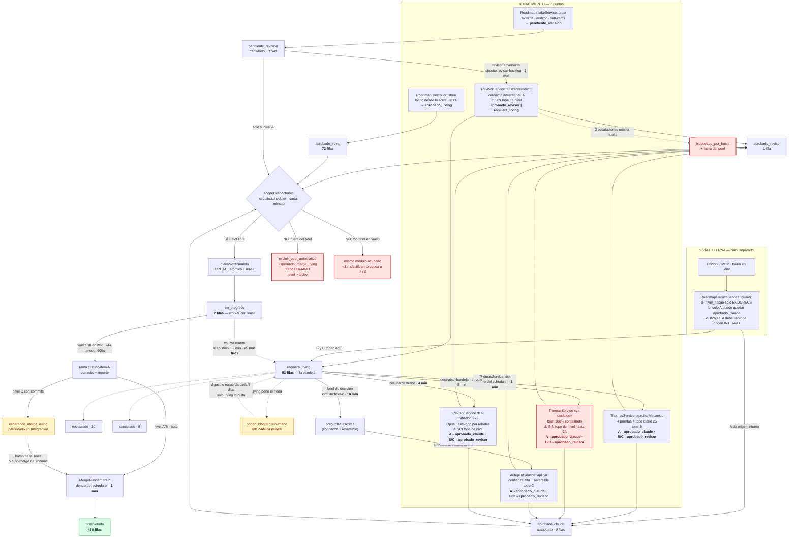

# Ciclo de vida de un item — el flujo REAL

> **Medido el 2026-08-19 en dev.** Descriptivo, no aspiracional: si algo funciona de una forma rara
> pero real, está dibujado raro y real. Este documento sirve para depurar, no para presentar.

## Los estados que existen de verdad

`SELECT estado_aprobacion, COUNT(*) FROM roadmap_items GROUP BY 1` — no la lista teórica:

| estado_aprobacion | filas |
|---|---:|
| `completado` | 436 |
| `aprobado_irving` | 72 |
| `requiere_irving` | 53 |
| `rechazado` | 10 |
| `cancelado` | 8 |
| `en_progreso` | 2 |
| `aprobado_revisor` | 1 |
| `pendiente_revision` | **0** |
| `aprobado_claude` | **0** |

⚠️ **`pendiente_revision` y `aprobado_claude` marcan cero, y no es que no se usen: son
TRANSITORIOS.** Un item A nace `pendiente_revision` y el scheduler lo reclama en la vuelta siguiente
(≤ 1 min); `aprobado_claude` dura lo mismo. Que estén en cero es señal de que el pool está drenando
bien, no de que estén muertos. La misma foto con la flota parada los mostraría acumulados.

⚠️ **`aprobado_revisor` en 1 contra `aprobado_irving` en 72** es la firma del destrabe de bandeja
muerto (ver `torre-como-funciona-hoy.md` §3): lo que Irving aprueba se acumula porque el motor que
lo movía no corre.

---

## El diagrama

> **`N4` va en rojo** no por su lógica sino porque el comando que lo invoca
> (`circuito:destrabar-bandeja`) **lleva 8 días fallando cada minuto**. Ese carril está dibujado
> porque existe en el código; hoy no se ejecuta.

---

## Tabla de consulta — «este item lleva días quieto, ¿por qué?»

| Estado / bandera | Qué significa | Quién lo saca de ahí | Cada cuánto |
|---|---|---|---|
| `pendiente_revision` | Recién creado, sin triar | Nivel A: el scheduler directo · B/C: el revisor | 1 min / 2 min |
| `requiere_irving` | La bandeja: espera decisión | Irving · autopilot (con brief) · des-trabador · Thomas | manual / 10 min / 4 min / 1 min |
| `aprobado_claude` | Nivel A autorizado por máquina | El scheduler lo reclama | **1 min** |
| `aprobado_revisor` | B/C autorizado por máquina | El scheduler lo reclama | **1 min** |
| `aprobado_irving` | Irving lo autorizó explícitamente | El scheduler (siempre pasa el tope de nivel) | **1 min** |
| `en_progreso` | Un worker lo tiene con lease | El propio worker · o `reap-stuck` si murió | — / **25 min** |
| `esperando_merge_irving` | C terminado, rama con commits | `MergeRunner` (botón o auto-merge) | 1 min tras encolar |
| `bloqueado_por_bucle` | 3 escalaciones con la misma huella | Un cambio material, o destrabe manual | manual |
| `excluir_pool_automatico` | Master switch fuera del pool | Quitarlo a mano, o `forzar=true` | manual |
| `origen_bloqueo = 'humano'` | **Freno de Irving. No caduca.** | **Sólo Irving** | recordatorio cada 7 días |
| `origen_bloqueo = 'clasificador'` | Consejo automático; **no frena** | Caduca a los 14 días… si `circuito:re-triage` corriera | ⛔ **no agendado** (#808) |
| `modulo` = «Sin clasificar» | Footprint desconocido: corre solo y bloquea a las 6 | `circuito:clasificar-modulo` | manual |
| `completado` / `cancelado` / `rechazado` | Terminales de verdad | — | — |
